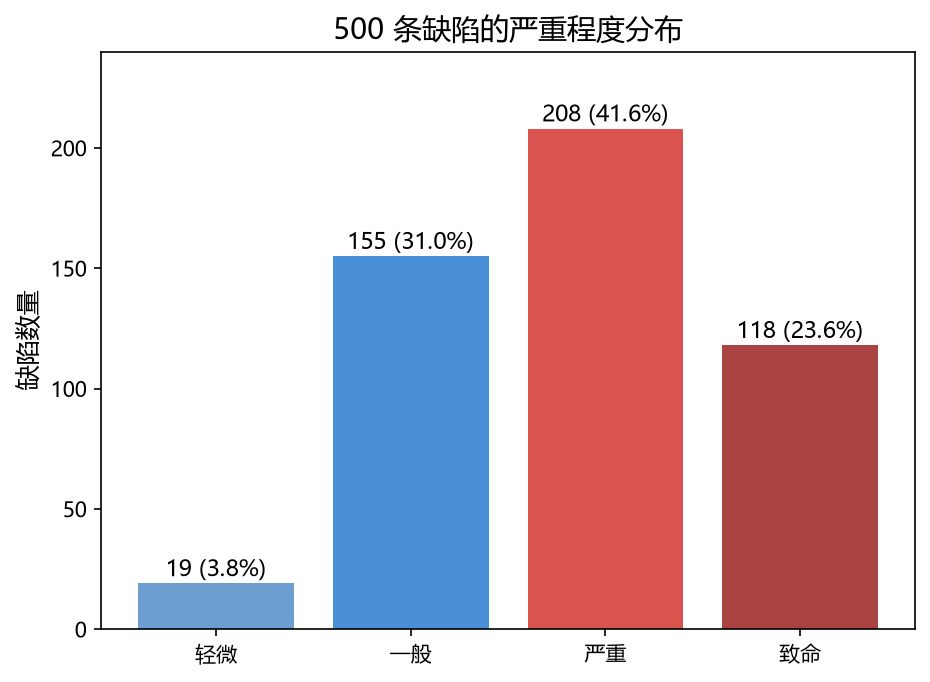
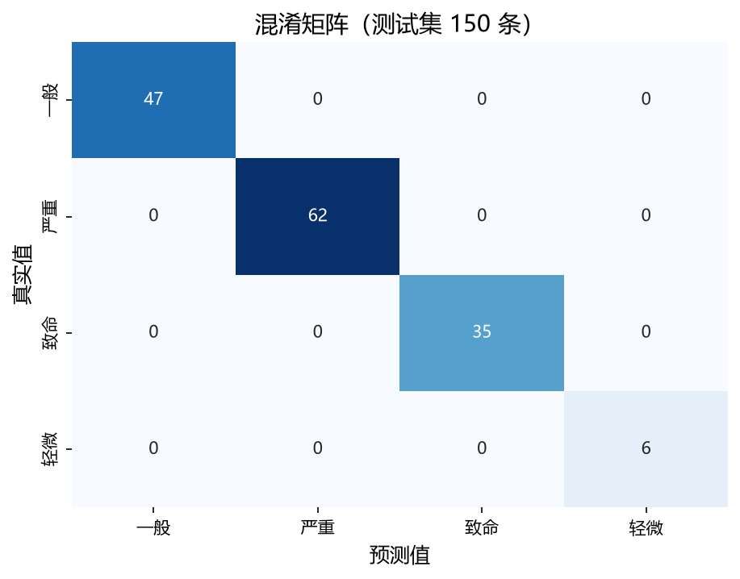
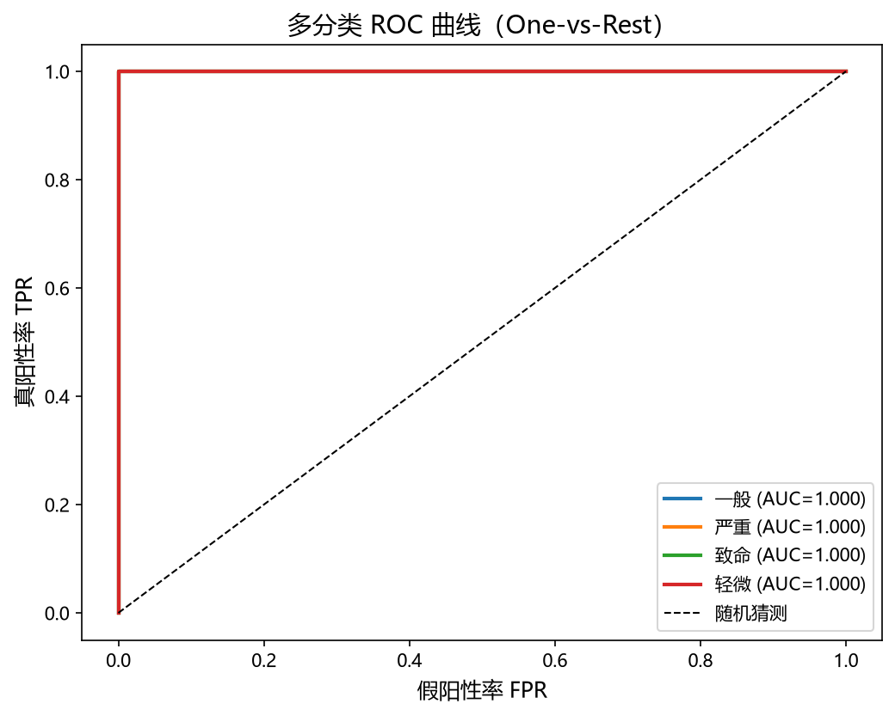
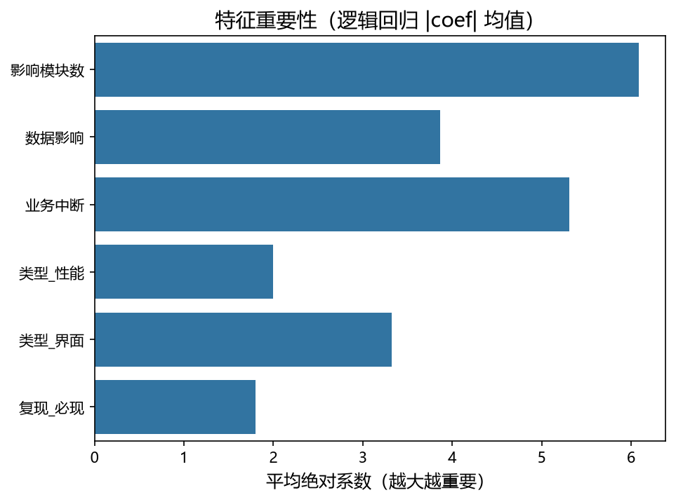
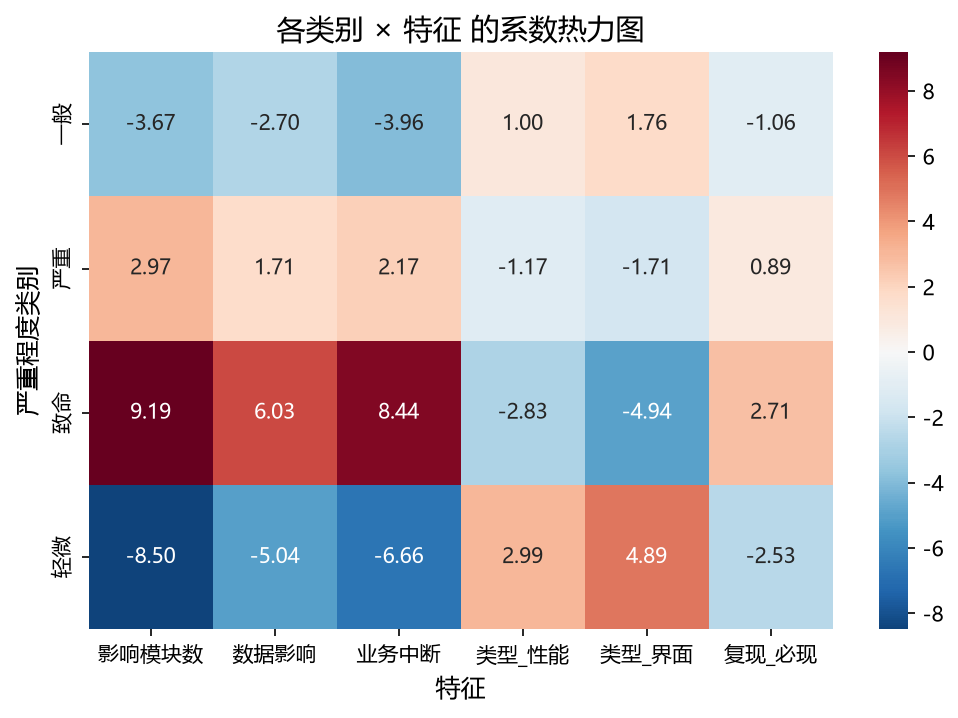

# 政务系统缺陷严重度智能分类

> 基于运维实习中的缺陷记录经验，用机器学习自动判断政务系统缺陷严重程度，辅助运维同学快速分级处置。

| | |
|---|---|
| **任务类型** | 多分类（致命 / 严重 / 一般 / 轻微） |
| **数据规模** | 500 条模拟缺陷记录（训练 350 / 测试 150） |
| **技术栈** | Python · Pandas · scikit-learn · Matplotlib / Seaborn |
| **最终模型** | 逻辑回归（C=10） |
| **测试集准确率** | 1.000（模拟数据特性，详见"局限"） |

---

## 一、背景与目标

实习期间负责政务系统的驻场运维，缺陷（Bug）记录由人工按经验分级为"致命/严重/一般/轻微"。痛点有两个：

1. **分级靠经验、主观性强**：不同人打分标准不一致，容易漏掉高危缺陷；
2. **重复劳动**：特征明确（影响模块、是否中断业务等）时，分级其实是规则化的，可以让机器来做。

**目标**：用历史缺陷数据训练分类模型，自动输出缺陷严重程度，让人工聚焦在高危缺陷的复核上。

---

## 二、数据集

500 条模拟缺陷记录（基于真实缺陷场景设计，字段如下）：

| 字段 | 类型 | 说明 |
|------|------|------|
| 缺陷类型 | 分类 | 功能 / 性能 / 界面 |
| 影响模块数 | 数值 | 1–5 |
| 复现概率 | 分类 | 必现 / 偶发 |
| 数据影响 | 0/1 | 是否影响数据 |
| 业务中断 | 0/1 | 是否造成业务中断 |
| 严重程度 | 标签 | 致命 / 严重 / 一般 / 轻微 |

**生成规则**（按缺陷场景设计的加权评分）：功能 +2 / 性能 +1 / 界面 +0；影响模块数直接加 1–5；必现 +2 / 偶发 +1；影响数据 +2；业务中断 +3。总分 ≥10 致命、7–9 严重、4–6 一般、≤3 轻微。

**类别分布**（类不平衡是主要挑战）：



轻微类仅 19 条（3.8%），导致初始模型对它几乎无法识别（召回率 0.17）。

---

## 三、方法

**流程**：数据清洗与特征工程 → 多模型对比 → 超参数调优 → 评估输出

1. **特征工程**：`LabelEncoder` 标签编码；`get_dummies` 对分类特征 OneHot 编码（drop_first 防虚拟变量陷阱）；`train_test_split(stratify=y)` 分层抽样；`StandardScaler` 标准化（仅训练集 fit，防数据泄露）。
2. **多模型对比**：随机森林、SVM、KNN、逻辑回归、决策树 × 5 折交叉验证。

   | 模型 | 交叉验证准确率 |
   |------|--------------|
   | **逻辑回归** | **0.954** ← 最优 |
   | 随机森林 | 0.906 |
   | SVM(RBF) | 0.874 |
   | KNN(K=5) | 0.840 |
   | 决策树 | 0.803 |

3. **超参数调优（GridSearchCV）**：搜索 C × class_weight，目标提升轻微类召回率。最优参数 **C=10, class_weight=None, solver=lbfgs**——关键发现是"拟合不足"而非"类不平衡"：C 太小（默认 1）导致模型不敢用力学，轻微/一般边界放歪；C=10 后模型学会打分规则，轻微类召回率 0.17 → 1.00。
4. **评估**：混淆矩阵、多分类 ROC-AUC（One-vs-Rest）、特征重要性（逻辑回归系数）。

---

## 四、结果

**测试集最终成绩**（150 条，模型未见过的数据）：

| 类别 | 精确率 | 召回率 | F1 | 样本数 |
|------|--------|--------|-----|--------|
| 一般 | 1.00 | 1.00 | 1.00 | 47 |
| 严重 | 1.00 | 1.00 | 1.00 | 62 |
| 致命 | 1.00 | 1.00 | 1.00 | 35 |
| 轻微 | 1.00 | 1.00 | 1.00 | 6 |

- **准确率 1.000**，宏平均 F1 = 1.00，加权平均 F1 = 1.00
- **混淆矩阵**：150 条全部落在对角线，高危缺陷（致命/严重）零漏报



**多分类 ROC-AUC**（One-vs-Rest）：四个类别 AUC 均为 1.000，整体 AUC（macro）= 1.0000



**特征重要性**（逻辑回归 |系数| 均值）：**影响模块数 > 业务中断 > 数据影响**





---

## 五、结论与局限

**结论**：

1. 逻辑回归在 500 条模拟数据上达到 100% 准确率，且**特征重要性与业务打分规则完全一致**（业务中断 +3、模块数直接加、数据影响 +2）——说明模型学到的是业务规则本身，**行为可解释**，这是运维场景敢用模型的前提。
2. 高危缺陷（致命/严重）零漏报，符合"宁可多报、不可漏报"的运维诉求。

**局限（实话实说）**：

1. **模拟数据**：准确率 1.0 是"规则生成数据 + 完全可分"的必然结果，**不代表真实系统效果**，未在任何真实政务系统上验证。
2. **样本量小**：轻微类仅 19 条，模型对它的学习依赖规则可分性；真实数据需要补充样本。
3. 特征仅 6 个，真实场景还可能有文本描述（缺陷描述、日志）等非结构化信息。

**改进方向**：

- 接入真实缺陷记录，验证并重训模型；
- 对轻微/一般等易混类补样本或用 `class_weight` 兜底；
- 引入缺陷文本描述做文本特征（后续项目 V2.0 计划：日志文本故障分类、时序异常检测）。

---

## 六、如何运行

```bash
# 环境要求：Python 3.12+
pip install pandas numpy scikit-learn matplotlib seaborn jupyterlab

# 启动 JupyterLab，按 1→5 顺序运行 notebooks/ 下的笔记本
jupyter lab
```

---

## 七、项目结构

```
项目 V1.0/
├── README.md
├── requirements.txt
├── defect_data.csv            # 500 条模拟缺陷数据
├── images/                    # 报告配图（5 张）
│   ├── class_distribution.png
│   ├── confusion_matrix.png
│   ├── roc_curve.png
│   ├── feature_importance.png
│   └── coef_heatmap.png
└── notebooks/
    ├── 项目V1.0：1.启动.ipynb
    ├── 项目V1.0：2.数据清洗与特征工程.ipynb
    ├── 项目V1.0：3.多模型训练对比.ipynb
    ├── 项目V1.0：4.GridSearchCV 调参.ipynb
    └── 项目V1.0：5.评估输出.ipynb
```

> 说明：本项目为个人学习项目，全部基于模拟数据，仅用于展示机器学习在运维缺陷管理中的应用思路。
